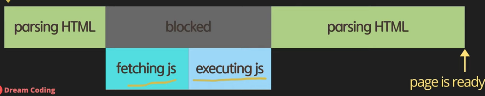
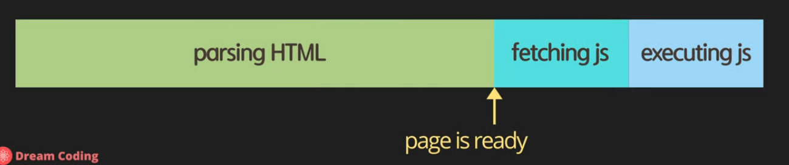
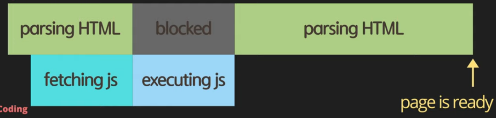
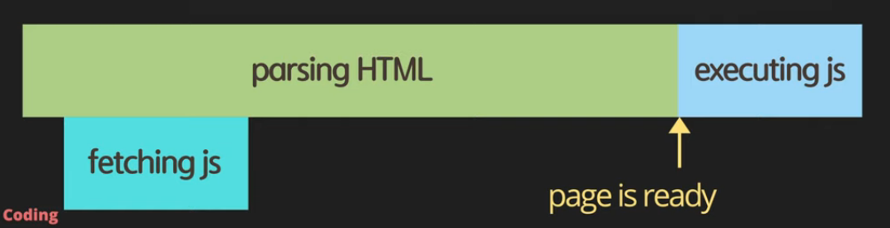
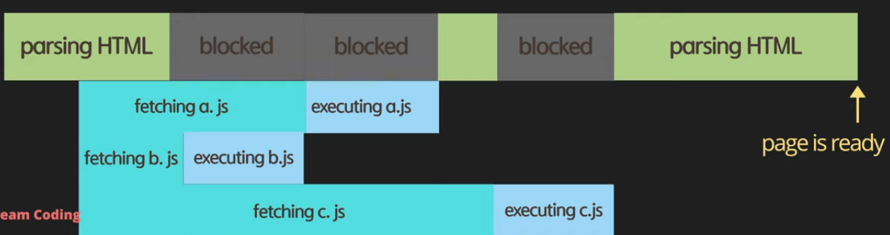
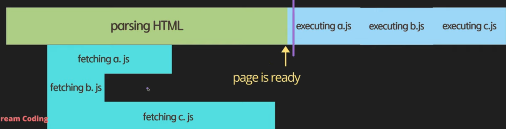

# script async defer

> script js의 위치와 async defer에 따른 동작 차이 


1. head
```js
<!DOCTYPE html>
<html lang="en">
<head>
    <meta charset="UTF-8">
    <title>Document</title>
    <script src="main.js"></script>
</head>
<body>
    
</body>
</html>
```



- js 파일 사이즈가 클 경우 웹 페이지를 볼 때까지 시간이 오래 걸릴 수 있음.

2. body
```js
<!DOCTYPE html>
<html lang="en">
<head>
    <meta charset="UTF-8">
    <title>Document</title>
</head>
<body>
    <script src="main.js"></script>
</body>
</html>
```




- html parsing은 빠르지만 여전히 js 파일을 가져오고 실행하는 시간을 기다려야함.

3. head async

```js
<!DOCTYPE html>
<html lang="en">
<head>
    <meta charset="UTF-8">
    <title>Document</title>
    <script async src="main.js"></script>
</head>
<body>
    
</body>
</html>
```



- fetching을 병렬적으로 실행하기 때문에 body에 넣는 것 보단 시간을 절약한다.
- 하지만 html 파싱이 되기도 전에 js를 실행하기 때문에 querySelector를 사용해서 dom 요소를 조작한다거나 할 때, 원하는 요소가 아직 정의되어 있지 않을 수 있음.
- excuting을 할 때는 html parsing이 블락되어 사용자가 페이지를 보기까지 여전히 시간이 걸림.

4. head defer

```js
<!DOCTYPE html>
<html lang="en">
<head>
    <meta charset="UTF-8">
    <title>Document</title>
    <script defer src="main.js"></script>
</head>
<body>
    
</body>
</html>
```



- defer이 가장 좋은 옵션
- html을 읽으면서 script defer를 만나면 병렬적으로 fetch 후, html parsing이 끝나면 js 실행.

5. head asnyc 여러개

```js
<!DOCTYPE html>
<html lang="en">
<head>
    <meta charset="UTF-8">
    <title>Document</title>
    <script async src="a.js"></script>
    <script async src="b.js"></script>
    <script async src="c.js"></script>
</head>
<body>
    
</body>
</html>
```



- 정의된 스크립트 순서에 상관없이 js를 가져온 대로 js 실행.
- 순서에 의존적인 js인 경우 문제가 될 수 있음.

6. head defer 여러개

```js
<!DOCTYPE html>
<html lang="en">
<head>
    <meta charset="UTF-8">
    <title>Document</title>
    <script defer src="a.js"></script>
    <script defer src="b.js"></script>
    <script defer src="c.js"></script>
</head>
<body>
    
</body>
</html>
```



- parsing 하는 동안 js 가져오고, 스크립트 순서대로 js 실행. 


--- 

# use strict

```js
// Whole-script strict mode syntax
'use strict';

console.log('Hello World!');
```

- 순수 바닐라 자바스크립트 사용할 때는 use strict 사용하는게 좋다. (ES5 부터)
